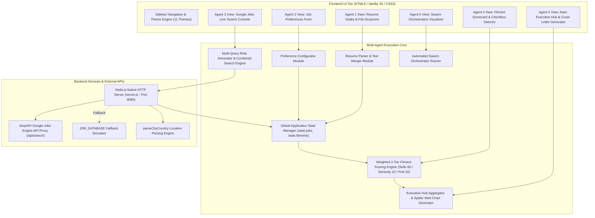
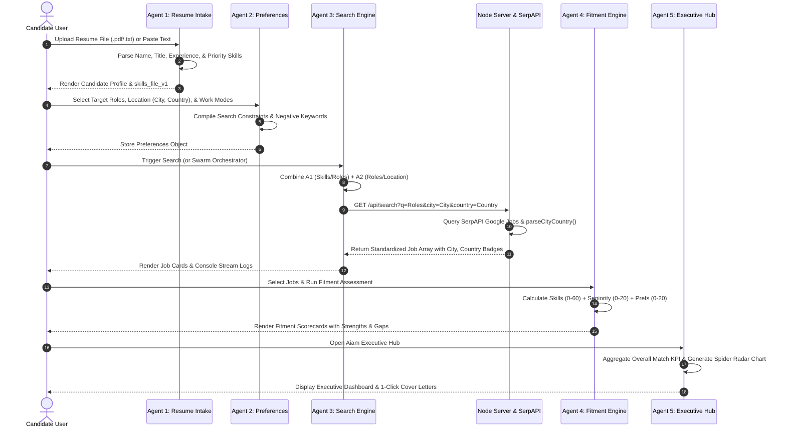
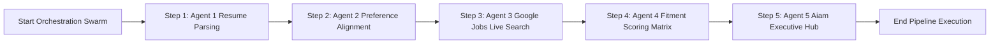

# 🏗️ Solution Architecture & Process Flow Diagrams

This document outlines the **Solution Architecture** and **Process Flow Diagrams** for the **Aiam Agentic Job Search Engine** — an autonomous multi-agent platform designed for candidate intake, live job discovery, fitment scoring, and executive dashboard analytics.

---

## 🏛️ 1. Solution Architecture Diagram

### 🧩 System Component Breakdown

---

## 🔄 2. Process Flow Diagram

### 🌊 End-to-End Sequence & Data Pipeline

---

## ⚡ 3. Swarm Orchestration Flowchart (Agent 6)

